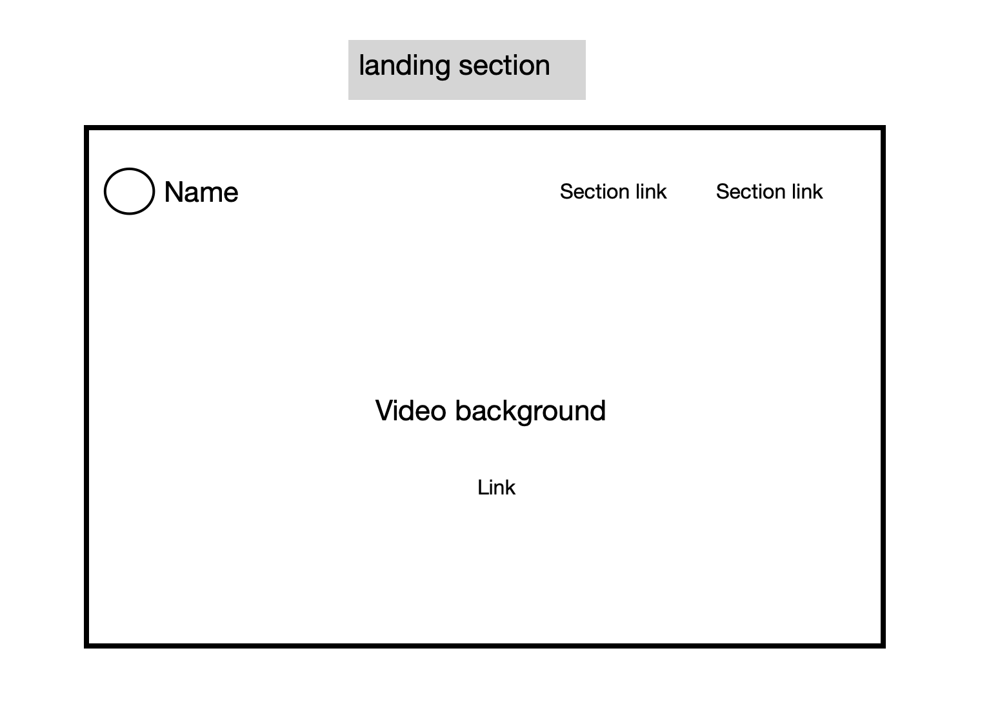
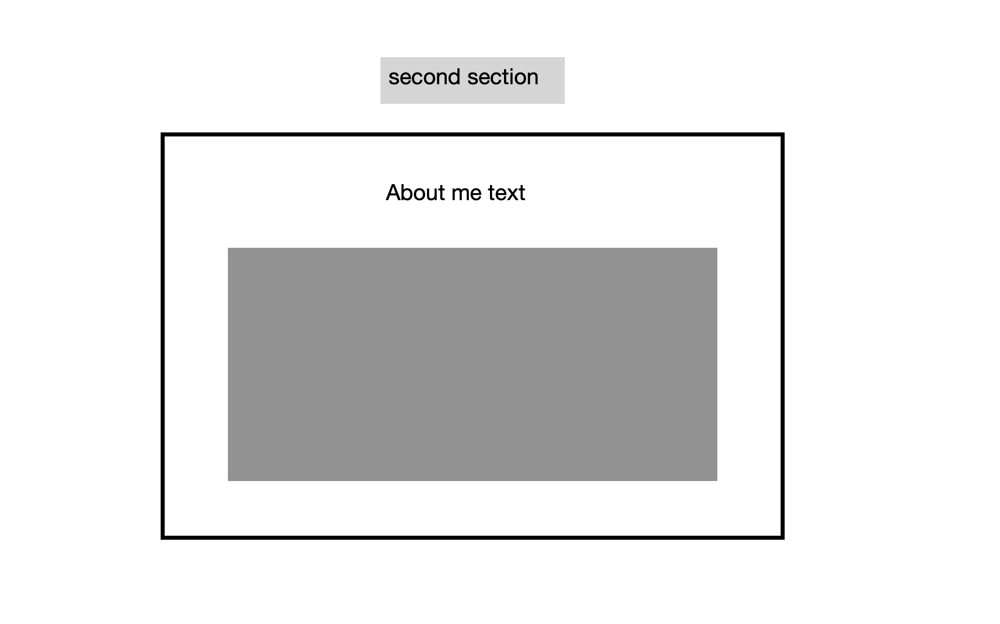
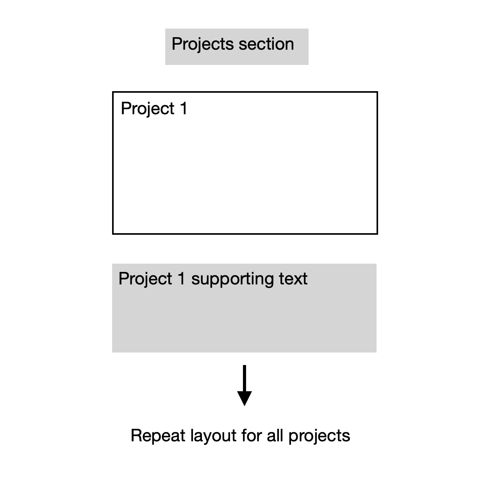

# FAC application website

A website to support my application to founders and coders skills bootcamp.

## Requirments

All code is written by you
No external libraries
Hosted on GitHub Pages
Semantic HTML5 elements
CSS grid or flexbox layout (or both)
DOM event listeners for user interaction
DOM updates in response to user interaction

## Planning 

Wireframe:

## Building 

Will use HTML CSS AND JS