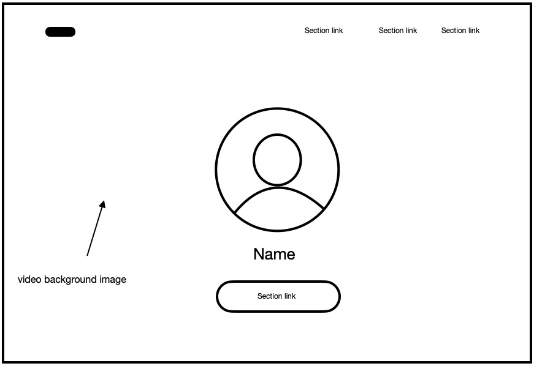
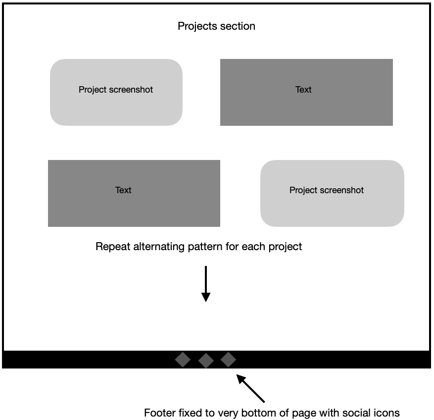
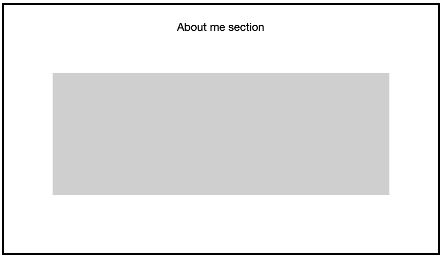

# FAC application website

A website to support my application to founders and coders skills bootcamp.

## Requirments

All code is written by you, No external libraries, Hosted on GitHub Pages, Semantic HTML5 elements, CSS grid or flexbox layout (or both), DOM event listeners for user interaction, DOM updates in response to user interaction.

## Planning 

Wireframe:

## Building 

I will use:  HTML CSS and Vanilla JS. 

## Debugging

I will debug my js using console.log() in various stages of my js code. This will then log my desired output to the js console within the google chrome dev tools feature. I will use the live server extension in vs code to render my project to the chrome browser in real time.